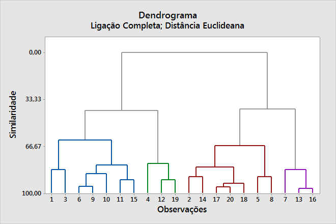
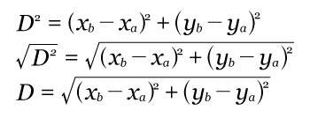
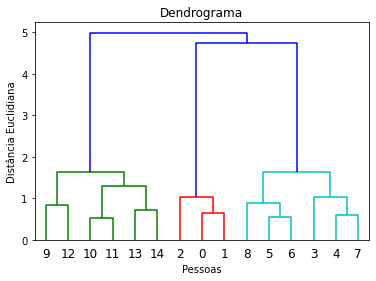
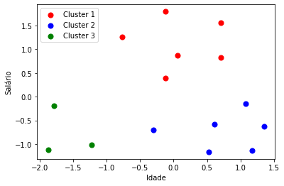

# Agglomerative Clustering

## Conceito (O que é? Pra que serve?)

Nesse algoritmo, temos uma árvore que será responsável por definir a quantidade ideal de clusters. 
No começo, cada registro é um cluster. Ou seja, a quantidade de dados que temos é a quantidade de clusters.
Os resultados temos um dendograma para ilustrar os resultados. O dendrograma é dado por algo assim:

<div>

</div>

Quanto mais alta a altura da ligação entre os dados, menor é a proximidade entre os dados e mais distantes estão entre um e o outro.

Depois dessa separação, seguiriamos para uma abordagem tradicional do K-means.

## Classes de Problemas com melhores resultados

Classificação de modelos em que não se conhece muito bem quais são as classificações que desejamos encontrar. Por exemplo: Não sabemos em quantas categorias dividir os seres vivos, ou os tipos de plantas. Por iss vemos muitas aplicações biológicas com esse algoritmo, como é o caso da taxonomia de animais e plantas. 

## Definição Teórica e Modelagem Matemática

A teoria e a modelagem matemática desse algoritmo se baseia em comparar a distancia entre dois pontos e agrupar aqueles de menor valor. 

<div>

</div>

Depois disso, é feito é classificada a distância entre esse pequeno agrupamento e os próximo ponto ou agrupamento até todos estarem conectados. 
É importante ressaltar que quanto mais distante está, mais alta deve ser a barra que faz essa ligação para assim poder haver uma padronização nessa classificação de distâncias.

## Vantagens e Desvantagens (limitações)

Algumas das vantagens desse algoritmo é poder 'terceirizar' essa decisão de quantidade de clusters para o próprio modelo. 
Uma das desvantagens é o fato de não existir uma revisão dos agrupamentos e clusters que foram feitos. Quando coloca esse modelo na prática ele sempre vai replicar os parametros utilizados, mas não há uma validação constante desses daods. 


## Exemplo de uma aplicação em Python


```Python
import matplotlib.pyplot as plt
from scipy.cluster.hierarchy import dendrogram, linkage
from sklearn.cluster import AgglomerativeClustering
from sklearn.preprocessing import StandardScaler
import numpy as np

x=[20,  27,  21,  37,  46, 53, 55,  47,  52,  32,  39,  41,  39,  48,  48]  
y=[1000,1200,2900,1850,900,950,2000,2100,3000,5900,4100,5100,7000,5000,6500]
# Mostra os pontos no gráfico
# plt.scatter(x,y)

base = np.array([[20,1000],[27,1200],[21,2900],[37,1850],[46,900],
                 [53,950],[55,2000],[47,2100],[52,3000],[32,5900],
                 [39,4100],[41,5100],[39,7000],[48,5000],[48,6500]])
scaler = StandardScaler()
base = scaler.fit_transform(base)

dendrograma = dendrogram(linkage(base, method = 'ward'))
plt.title('Dendrograma')
plt.xlabel('Pessoas')
plt.ylabel('Distância Euclidiana')
hc = AgglomerativeClustering(n_clusters = 3, affinity = 'euclidean', linkage = 'ward')
previsoes = hc.fit_predict(base)


plt.scatter(base[previsoes == 0, 0], base[previsoes == 0, 1], s = 50, c = 'red', label = 'Cluster 1')
plt.scatter(base[previsoes == 1, 0], base[previsoes == 1, 1], s = 50, c = 'blue', label = 'Cluster 2')
plt.scatter(base[previsoes == 2, 0], base[previsoes == 2, 1], s = 50, c = 'green', label = 'Cluster 3')
plt.xlabel('Idade')
plt.ylabel('Salário')
plt.legend()
```

Os resultados que temos são:
Dendrograma:

<div>

</div>

Clusters:


<div>

</div>


## Referências

* http://www.vision.ime.usp.br/~pmiranda/mac6903_2s12/aulas/aula18.pdf
* https://repositorio.ufscar.br/bitstream/handle/ufscar/4537/2596.pdf?sequence=1&isAllowed=y
* https://www.youtube.com/watch?v=Nf-vaOIQA3E
* https://www.computersciencemaster.com.br/como-funciona-o-algoritmo-de-agrupamento-hierarquico/