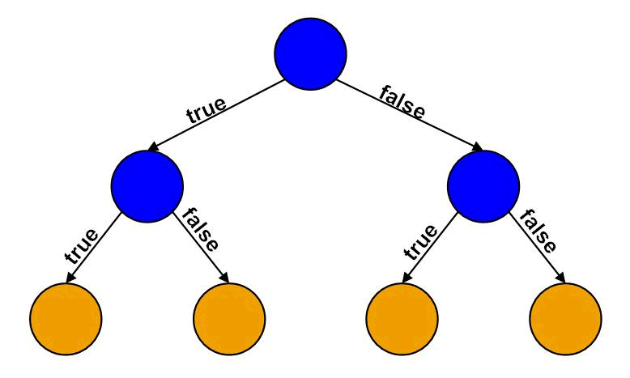

# K-Nearest Neighbors (KNN)

## Conceito (O que é? Pra que serve?)

No algoritmo de árvore de decisão, seguimos o padrão de ir em cada folha da nossa árvore e analisar uma pergunta. No caso da imagem a seguir vemos um exemplo:

Essa árvore é generica, mas podemos querer tentar prever se uma pessoa iria sobreviver a um acidente de avião. Podemos começar com uma pergunta como 'o acidente foi em zona urbana.' Se verdadeiro seguimos um caminho, se não, seguimos outro. No caso de ser em zona urbana, poderiamos perguntar 'atingiu uma construção.' Caso fosse falso, teria sobreviventes. E o mesmo se aplica para o outro lado.

Nada mais é que uma metodologia de avaliar acontecimentos para chegar a uma conclusão. Porém a partir da árvore de decisões, temos algumas variações. E também precisamos avaliar qual a melhor ordem em que as perguntas aparecem.

## Classes de Problemas com melhores resultados
## Definição Teórica e Modelagem Matemática
## Vantagens e Desvantagens (limitações)
## Exemplo de uma aplicação em Python