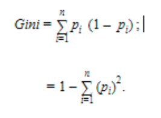
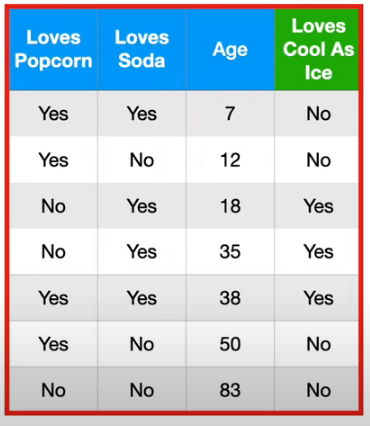
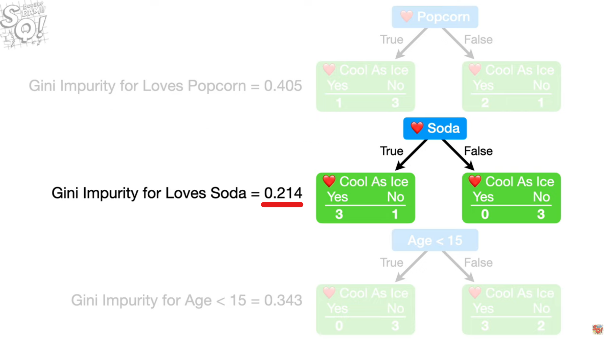

# Decision Trees e Ensembles of Decisions Trees


## Conceito (O que é? Pra que serve?)

No algoritmo de árvore de decisão, seguimos o padrão de ir em cada folha da nossa árvore e analisar uma pergunta. No caso da imagem a seguir vemos um exemplo:

<div>

</div>

Essa árvore é generica, mas podemos querer tentar prever se uma pessoa iria sobreviver a um acidente de avião. Podemos começar com uma pergunta como 'o acidente foi em zona urbana.' Se verdadeiro seguimos um caminho, se não, seguimos outro. No caso de ser em zona urbana, poderiamos perguntar 'atingiu uma construção.' Caso fosse falso, teria sobreviventes. E o mesmo se aplica para o outro lado.

Nada mais é que uma metodologia de avaliar acontecimentos para chegar a uma conclusão. Porém a partir da árvore de decisões, temos algumas variações. E também precisamos avaliar qual a melhor ordem em que as perguntas aparecem.


## Classes de Problemas com melhores resultados

Problemas que tem pouca mutação de dados, e que que o dataset não tenha muitos dados apresentam melhores resultados. Principalmente naqueles problemas que precisamos gerar uma visualização. Além de trabalhar bem com os datasets que não foram normalizados e tem falta ou inconsistencia em algumas partes.

## Definição Teórica e Modelagem Matemática

Para saber qual informação deve vir primeiro (no topo) da árvore de decisão, existem calculos que devem ser feitos e comparar os resultados.

Ficará no topo da árvore, aquelas informações com menor indice de Gini de acordo com essa fórmula:

<div>

</div>

Utilizamos essa fórmula para calcular esse indice, e depois aplicamos para cada indicador que temos em nosso dataset. No caso da tabela abaixo, vamos calcular o indice de Gini para 'pipoca', 'refrigerante' e 'idade'.

<div>

</div>

Nesse exemplo, temos uma tabela com alguns dados. Calculando a impureza de Gini, conseguimos definir qual será o criterio do topo, e assim por diante, como vemos a seguir:

<div>

</div>

E esse processo se perdura para o restante da árvore.


* Imagens retiradas do vídeo: https://www.youtube.com/watch?v=_L39rN6gz7Y


Além das árvores de decisões, temos as subclassificações do algoritmo em que faz a combinação de várias árvores para tentar prever melhor os resultados. São elas:

*   Bootstrap aggregating
    *   Tambem conhecido como Bagging, é uma tecnica geral de combinar diversas formas de predição. No caso especifico das árvores de decisão, estamos falando em criar diferentes árvores, cada uma com um subset do nosso dataset e depois atribuir a cada árvore o poder de 'voto'. Consequentemente, teremos uma maioria de votos por uma decisão que seria a decisão que o algoritmo toma como predição.
*   Random forests
    *   Como foi mostrado anteriormente, o algoritmo usa os dados do nosso dataset para determinar quais serão os nós iniciais e qual informação será utilizada em cada nó, sempre se baseando no indice de Gini. Porém, no random forest, existe uma aleatoriadade na escolha das informações, gerando um subset que será usado para a criação da árvore de decisão. São criadas várias árvores, cada qual utilizando uma parte do dataset para ver o indice de Gini e montar a árvore. Essa aleatóriedade e multiplicidade nas árvores faz com que ele entregue bons resultados. Por isso, esse é um dos algoritmos mais utilizados e populares recentemente.
*   Extremely Randomized Trees
    *  Como comentado anteriormente, as árvores de decisão seguem uma conta matemática para decidir qual nó ficará em qual posição. Nesse caso, o 'extreme' é causado pelos nós terem sua ordem escolhida de forma aleatória.  Do ponto de vista de utilização de processamento e poder computacional ela é mais eficiente por não gerar tantas contas para decidir a sequencia de cada nó para cada uma das árvores. 


## Vantagens e Desvantagens (limitações)

Algumas vantagens desse algoritmo é que ele é simples de implementar pois não demanda muito esforço do ponto de vista de preparação dos dados na fase pré processamento, o algoritmo é relativamente simples tecnicamente para poder entender e aplica-lo, além dos dados não precisarem ser normalizados. E a falta de algum dado na base não afeta de forma tão significativa quanto outros algoritmos. 
Algumas desvantagens que temos é que o tempo de treinamento pode ser custoso do ponto de vista de recursos e tempo de treinamento a medida que a quantidade de dados aumenta. E também tem o fator que poucas alterações no nosso modelo de treinamento, pode causar grandes mudanças na estrutura e ordem das perguntas. E por causa do tempo de processamento seria inviável ficar fazendo novos treinamentos constantemente. E também pode acabar havendo um overfitting.

## Exemplo de uma aplicação em Python

Para essa aplicação, vamos usar o modelo de random forest. A base de dados se encontra nessa pasta. Usaremos o sklearn como biblioteca para nos auxiliar:

```Python
import pandas as pd
import numpy as np
# Tipo de algortimo de classificação
from sklearn.ensemble import RandomForestClassifier
# Função para separar o banco de dados de treino e validação
from sklearn.model_selection import train_test_split
data = pd.read_csv('/content/train.csv') #Importa o train do titanic, disponivel no kaggle e nessa pasta
data = data.drop(['Name', 'Ticket', 'Embarked'], axis = 1)
# Define a chave primaria do dataframe sendo o PassengerId
data = data.set_index(['PassengerId'])
# Renomeia uma coluna do dataset
data = data.rename(columns= {'Survived': 'Target'}, inplace= False)
# Para transformar os dados categoricos em dados, e adaptar para poder ser mais fácilmente aceito por algoritmos de machine learning, 
# Vamos trabalhar com as transformações
# Feito um processo manual para primeiro projeto, mas existem ferramentas que fazem isso de forma mais automatizada

# Se 'Sex' for female, converte para 1, se não for, converte para zero.
data['is_Woman'] = np.where(data['Sex'] == 'female', 1, 0)

# Convertendo as classes (primeira classe, segunda classe e terceira classe) em três tabelas diferentes com 1 para sim e 0 para não.
data['Pclass_1'] = np.where(data['Pclass'] ==1, 1, 0)
data['Pclass_2'] = np.where(data['Pclass'] ==2, 1, 0)
data['Pclass_3'] = np.where(data['Pclass'] ==3, 1, 0)

# Tira os dados que ficam duplicados (a coluna Pclass e a coluna do sexo como dado categorico)
data = data.drop(['Sex', 'Pclass'], axis=1)
# Verificar os dados que estão vazios na nossa tabela
# Verificamos que existem 177 pessoas sem o dado de idade categorizado
# E 687 Sem a cabine definida
# Nesse caso, vamos subistituir todos os valores nulos por 0.
data.fillna(0, inplace=True)
# Para o algoritmo da amostragem, vamos separar a base de dados em treino e teste.
# Com isso, vamos limpar algumas informações 
# Separo com 30% (test_size) para o teste e 70% para treinamento
x_train, x_test, y_train, y_test = train_test_split(
    data.drop(['Target', 'Cabin'], axis=1),
    data['Target'],
    test_size = 0.3,
    random_state = 1234
)

[{'train': x_train.shape}, {'test': x_test.shape}]
# Modelo de floresta aleatoria:
# Sobre arvores de decisão (prévia para random forest)
# https://www.youtube.com/watch?v=_L39rN6gz7Y&ab_channel=StatQuestwithJoshStarmer
# Sobre random Forest
# https://www.youtube.com/watch?v=J4Wdy0Wc_xQ
# https://www.youtube.com/watch?v=nyxTdL_4Q-Q
rndforest = RandomForestClassifier(n_estimators = 1000,
                                   criterion= 'gini',
                                   max_depth = 5)

rndforest.fit(x_train, y_train)
probability = rndforest.predict_proba(data.drop(['Target', 'Cabin'], axis=1))[:,1]
classification = rndforest.predict(data.drop(['Target','Cabin' ], axis=1))
data['probability'] = probability
data['classification'] = classification
print(data)
```


## Referências

*   
*   https://www.youtube.com/watch?v=_L39rN6gz7Y
*   https://www.youtube.com/watch?v=J4Wdy0Wc_xQ
*   https://medium.com/@rnbrown/decision-tree-ensemble-methods-6a89181b7083
*   https://medium.com/@ODSC/why-do-tree-ensembles-work-8dc1648327a3
*   https://towardsdatascience.com/decision-trees-d07e0f420175
*   https://dhirajkumarblog.medium.com/top-5-advantages-and-disadvantages-of-decision-tree-algorithm-428ebd199d9a
