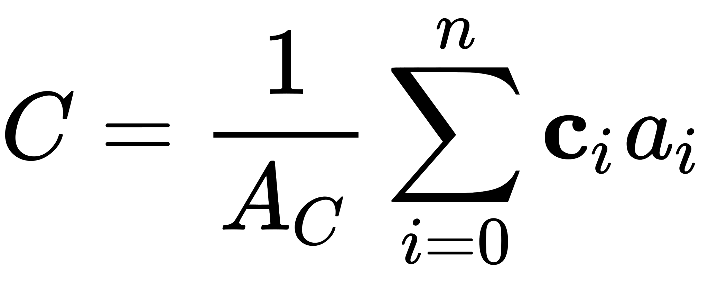
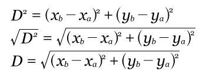
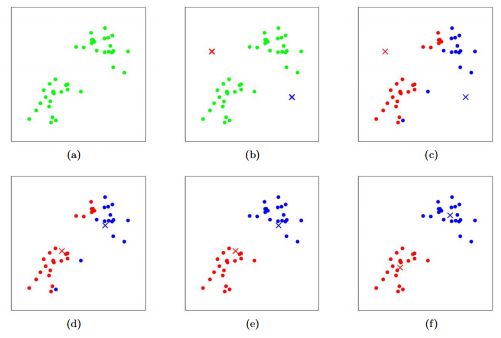
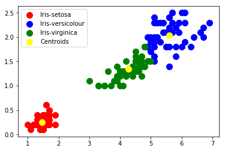

# K-Means Clustering


## Conceito (O que é? Pra que serve?)

O algoritmo K-Means é um modelo de clusterização de machine learning não supervisionado. Isso quer dizer que não temos uma resposta prévia sendo a correta como é o caso de um dataset do titanic que já sabemos o resultado ou uma base de dados de clientes que são inadimplentes. E, por isso, não há separação entre dados para treino e teste.

Mas voltando para o nosso algoritmo em questão, o K-means tem esse nome pois tem o objetivo de separar os clusters em k grupos cada um com uma média (means). A média no caso é o centroide daquele grupo.
Nesse caso, existe uma classificação dos dados para que depois, ao serem agrupados (veremos mais para frente como) haja uma proximidade das caracteristicas dessas variaveis. Para as variaveis serem classificadas, costuma-se usar poucas váriaveis e poder facilitar o entendimento visual da clusterização dos nossos dados.

Na imagem a seguir, vemos que o algoritmo K-means junta em um mesmo grupo elementos que tem caractéristicas que o algoritmo os julga similares:
<div>

</div>


## Classes de Problemas com melhores resultados

    Segmentar mercado: Clientes propensos a fazer uma compra. Agrupar tipos de clientes: perfil de compra, ou conteúdo que consome na plataforma. Além disso, agrupamento de redes sociais é um dos problemas que esse algoritmo se msotra bem eficaz, em que os anuncios aparecem para grupos que tem interesses em comum.

## Definição Teórica e Modelagem Matemática

Para poder utilizar a técnica de clusterização no modelo K-means, utilizamos o algoritmo de Lloyd dado a seguir.

Algoritmo de Lloyd: 
* Define quantos K - quantos grupos - se deseja trabalhar;
* Se inicializa centroides com a quantidade K;
* E junta os dados com o centroide do grupo que ele encontrar mais perto;
* Faz a média de todos os pontos de cada grupo e redefine o centroide;
* Depois disso, é comparado cada ponto com os novo centroide e reclassifica os pontos;
* Isso é feito até o momento em que nenhum ponto troca mais de grupo;

Para o calculo do novo centroide, em um dataset com duas variáveis, ou seja, em um plano 2D, temos a fórmula:
<div>

</div>

E para calcular a distância entre dois pontos, temos:
<div>

</div>


E podemos ver gráficamente a evolução do algoritmo. Em que os pontos marcados com X são o centroide e as cores são os clusters.

<div>

</div>


## Vantagens e Desvantagens (limitações)

A principal vantagem desse algoritmo é que ele tem diversas aplicações e não precisa ser previamente classificado. Por isso vemos ele sendo tão amplamente utilizado. Como citado no começo.
Uma desvantagem é a utilização de dados não normalizados e padronizados, pois o algoritmo é sensivel a isso. Além de ser lento quando se há muitas variaveis. E também, caso exista algum outlier na base de dados, isso pode atrapalhar os resultados. 

## Exemplo de uma aplicação em Python

```Python
# Visualiza o scatterplot de duas dimensões
import matplotlib.pyplot as plt
import seaborn as sns
from bokeh.sampledata.iris import flowers as floresdf
import warnings
warnings.filterwarnings("ignore")

# Quantos grupos existem nos dados
plt.scatter(x=floresdf.petal_length, y=floresdf.petal_width)
plt.xlabel('Largura da Pétala')
plt.ylabel('Altura da Pétala')
plt.title('Quantos CLUSTERS existem aqui?')
#  Mostra os pontos
plt.show()

# Faz o gráfico 
sns.scatterplot(x=floresdf.petal_length, y=floresdf.petal_width, hue=floresdf.species)
plt.show()

flores = floresdf.iloc[:,2:4].values

# Importa a biblioteca kmeans
from sklearn.cluster import KMeans

# Se não colocarmos o número de clusters, o valor default de número de clusters é de 8 clusters.
modelokm = KMeans(n_clusters=3)

# Cria o modelo de clusterização para agrupar os dados de flores
modelokm = modelokm.fit(flores)

# Mostra quais são as coordenadas de cada centroid para cada dimensão. Temos 2 dimensões e 3 clusters.
print(modelokm.cluster_centers_)
print(modelokm.n_clusters)
# Mostra as labels
labels = modelokm.labels_

print(labels)

# Faz a clusterização dos dados usando o modelo criado
grupos = modelokm.predict(flores)

# Mostra o Gráfico de Clusters
sns.scatterplot(x=flores[:,0], y=flores[:,1], hue=labels)
plt.show()

# Compara com o Gráfico anterior
sns.scatterplot(x=floresdf.petal_length, y=floresdf.petal_width, hue=floresdf.species)
plt.show()

# Visualizar os clusters com os Centroids
plt.scatter(flores[grupos == 0, 0], flores[grupos == 0, 1], s = 100, c = 'red', label = 'Iris-setosa')
plt.scatter(flores[grupos == 1, 0], flores[grupos == 1, 1], s = 100, c = 'blue', label = 'Iris-versicolour')
plt.scatter(flores[grupos == 2, 0], flores[grupos == 2, 1], s = 100, c = 'green', label = 'Iris-virginica')
plt.scatter(modelokm.cluster_centers_[:, 0], modelokm.cluster_centers_[:,1], s = 100, c = 'yellow', label = 'Centroids')
plt.legend()
plt.show()
```

Esse é o resultado visual do algoritmo:
<div>

</div>


## Referências

*   https://stanford.edu/~shervine/l/pt/teaching/cs-229/dicas-aprendizado-nao-supervisionado#clustering
*   https://stringfixer.com/pt/Lloyd's_algorithm
*   https://www.kaggle.com/eriveltonguedes/7-clusteriza-o-k-means-erivelton
*   https://www.youtube.com/watch?v=WqMnQuC19Rg
*   https://realpython.com/k-means-clustering-python/