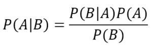

# Naive Bayes Classifiers


## Funcionamento

Cria uma tabela de probabilidade de algo ocorrer, baseado nas informações que temos no nosso dataset. 
Tenho um dataset falando na inadiplencia de pessoas e tenho dados como salario, balanço patrimonial, bens pessoais para garantia e as informações sobre qual foi o risco associado previamente a cada pessoa.
Ao fazer uma tabela de probabilidade, iremos ver a probabilidade de uma pessoa que tem salario acima da média ter um risco alto, médio e baixo de inadiplencia. E isso será feito para cada uma das informações que temos no nosso dataset.

Nesse algoritmo o treinamento ou fase de aprendizagem é a parte do código em que montamos nossa tabela de probabilidade baseado nos nossos dados. 


## Conceito (O que é? Pra que serve? )

Adivindo do Teorema de Bayes, o algoritmo Naive Bayes tem uma forte correlação com a área de estatística. Para que possamos ter uma compreensão completa desse algoritmo, vamos recapitular o teorema estatístico. Nele estamos tratando de probabilidade condicional. Vamos a uma situação: 
    
    * Se o tempo está frio, a chance de pescar um peixe grande é 20%. 
    * Se faz calor, a probabilidade de pescar um peixe grande é 50%. 
    * Sabemos que amanhã tem 30% de chance de fazer calor
    * Supondo que amanhã eu pegue um peixe grande, qual a probabilidade de ter feito sol?

Esse seria um exemplo de questão probabilistica para o teorema de Bayes, e trabalhando com as dadas probabilidades de cada acontecimento, temos um resultado final. Por isso, esse algoritmo funciona criando uma tabela de probabilidades de cada um dos acontecimentos e qual seria o resultado esperado se baseando nisso.

Exemplo de aplicação:

* Filtro de Spam - identifica palavras chaves
* Mineração de emoções - Computação afetiva - identifica palavras chaves - Uma empresa mede o grau de satisfação com a empresa baseado nas palavras associadas a ela nas redes sociais.
* Clusterização de documento texto - jornais, materias, arquivos - identifica palavras nos documentos e os separa por tipo: politica, economia, esportes...


O algoritmo é chamado naive - do inglês 'ingenuo' - pois ele não consegue fazer a distinção da ordem dos acontecimentos, por exemplo. Isso causaria alguns problemas, pois como sabemos, a ordem de palavras pode mudar totalmente o sentido atribuido a frase. Apesar desse 'problema' esse algoritmo é considerado muito bom para essas aplicações citadas pois o trade off é valido e apresenta bons resultados.

## Classes de Problemas com melhores resultados

Vemos vantagens nessa abordagem em problemas que trabalhamos com ocorrencia de dados. Por exemplo:
*   Para filtrar um spam: temos a recorrencia de palavras chaves que podem ou não classifica-los assim;
*   Recorrencia de palavras chaves ditas e/ou escritar por pessoas que estão com uma certa emoção;
*   Eventos recorrentes que tem forma relacionamento causa consequencia em que a probabilidade de um conjunto de fatores trazer um resultado esperado:
    *   Por exemplo: Não estudar para uma prova, não asssitir as aulas, não fazer exércicios, não frequentar as aulas e não ler o livro: o conjunto desses dados podem representar uma estatistica mais sólida do ponto de vista de resultado.

## Definição Teórica e Modelagem Matemática

No teorema de Bayes vemos que:

<div>

</div>

Em que calculamos:

*   P (B|A) = Essa é a probabilidade condicional que temos conhecimento. Portanto temos: qual a probabilidade de B acontecer dado que A acontece.
*   P (A) = Probabilidade de A acontecer
*   P (B) = Probabilidade de B acontecer
*   P (A|B) = Essa é a nossa probabilidade condicional que queremos. Essa é inversa a que temos dados. 

Para exemplificar: No teorema teriamos a probabilidade de ir pescar, sabendo das chances de chuva. E no caso, usando essa fórmula, vamos ter a probabilidade de ter chovido, sabendo que a pessoa foi pescar.

Quando vamos para o algoritmo de machine learning de Naive Bayes temos a comparação de P (A|B) para os casos positivos e negativos e depois fazemos uma comparação entre as probabilidades.
Então temos: 
*   A probabilidade para ter ido pescar em caso de:
    *   chuva
    *   Sem chuva.
*   E a probabilidade de não ter ido pescar sabendo dos casos de:
    *   chuva
    *   Sem chuva
  
Nesse exemplo já teriamos uma tabela que com as probabilidades condicionais dadas as situações. Em um caso de aplicação, poderiamos ter mais uma condicional, como o lago estar com nível de água cheio e vazio. E apartir disso, iriamos calcular a condicional P(B|A) composta com a informação do nível do lago e ir ou não pescar.

Vamos a um exemplo:

*   De 10 emails 7 não são spam e 3 são spam.
*   Nesse caso, há uma conta que a probabilidade geral de um email não ser spam é de 70% e 30% de ser spam.
---
*   Desses emails que não são spam há uma ocorrencia maior das palavras 'amigo' e 'querido'
*   No caso dos emails que são spam, temos uma ocorrencia maior das palavras 'oportunidade' e 'vantagem'.
---
*   Depois calcula quantas vezes apareceu as palavras 'amigo', 'querido', 'oportunidade', 'vantagem' tanto nos casos de ser spam e não ser. 
*   E por último há uma multiplicação da probabilidade de ser spam, com as probabilidade de aparecer cada palavra.
---
Ex: 70% de probabilidade de não ser spam X 20% de probabilidade de aparecer 'vantagem' X 10% de probabilidade de aparecer 'oportunidade';

Com isso, teremos um percentual final para essa combinação de palavras para um e-mail que não é spam. Fariamos o memso para o caso de ser spam. E chegariamos em valores de probabilidade de um e-mail com essa combinação de palavras ser spam ou não. 

Vale ressaltar que se a gente tiver nenhuma ocorrencia, teriamos uma multiplicação por zero e consequentemente a probabilidade final seria nula. Isso não acontece na realidade, pois se uma variavel por um indice muito forte, ela precisa mostrar uma probabilidade. Portanto para fazer o equilibrio dessas probabilidades condicionais, o algoritmo acrescenta 1 ocorrencia para cada situação. 
Em um exemplo, seria como se em um e-mail de spam 100% das vezes aparecesse a palavra 'download' mas a palavra 'querido' tivesse aparecido nenhuma vez até então. A probabilidade de ser spam seria zero, por causa da palavra 'querido'. Mas ao adicionar 1 para todas as ocorrencias, teriamos um balanceamento, sendo assim o e-mail com a combinação de palavras 'querido' e 'download' teria uma probabilidade de ser spam. 

## Vantagens e Desvantagens (limitações)

    As vantagens desse algoritmo é poder ter um treinamento rápido, pois ele só faz uma varredura e já consegue montar uma tabela de probabilidade de ocorrencias. Além de ser insenssivel para dados irrelevantes (aqueles que tem probabilidade de ocorrer ou não ocorrer quase igual) e lida bem com dados discretos e continuos.
    Porém, uma das desvantagens é que não existe uma independencia entre as caracteristicas. Ou seja, ele avalia a combinação de diversos fatores. Como nos exemplos anteriores, ele associa duas palavras do e-mail 'vantagem' e 'oportunidade' ou então associa diversas caracteristicas de um estudante.

## Exemplo de uma aplicação em Python

Aplicação em que verifica a probabilidade de um dado conjunto de dados ter uma saída usando naive bayes com a biblioteca sklearn:

```python:
import numpy as np
from sklearn.naive_bayes import GaussianNB
X = np.array([[-1, -1], [-2, -1], [-3, -2], [1, 1], [2, 1], [3, 2]])
Y = np.array([1, 1, 1, 2, 2, 2])

clf = GaussianNB()
clf.fit(X, Y)
GaussianNB()
print(clf.predict([[-0.8, -1]]))

clf_pf = GaussianNB()
clf_pf.partial_fit(X, Y, np.unique(Y))
GaussianNB()
print(clf_pf.predict([[-0.8, -1]]))
```

output esperado dessa predição: [1] e [1]