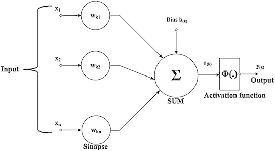
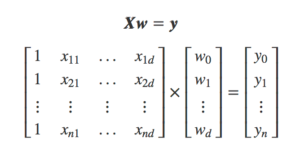

# Redes Neurais Profundas


## Funcionamento

As redes neurais profundas utilizam camadas de neurônios matemáticos para processar dados compreender a fala humana e reconhecer objetos visualmente. A informação é passada através de cada camada, com a saída da camada anterior fornecendo entrada para a próxima camada. A primeira camada em uma rede é chamada de camada de entrada (input layer), enquanto a última é chamada de camada de saída (output layer). Todas as camadas entre as duas são referidas como camadas ocultas (hidden layer). Cada camada é tipicamente um algoritmo simples e uniforme contendo um tipo de função de ativação.

## Conceito (O que é? Pra que serve? )

Redes neurais profundas são uma sub-área da Aprendizagem de Máquina, que emprega algoritmos para processar dados e imitar o processamento feito pelo cérebro humano. A aprendizagem profunda é responsável por avanços recentes em visão computacional, reconhecimento de fala, processamento de linguagem natural e reconhecimento de áudio. O aprendizado profundo é baseado no conceito de redes neurais artificiais, ou sistemas computacionais que imitam a maneira como o cérebro humano funciona.

Exemplo de aplicação:

* Uma rede neural para análise de imagens de trânsito;
* Uma rede neural para interpretação de documentos escritos ou digitados;

Redes neurais profundas são chamadas assim e se diferenciam de redes neurais comuns pela sua estrutura, nas redes profundas temos muito mais camadas ocultas (hidden layers) enquanto que nas redes neurais comuns temos apenas 3 camadas, uma camada de entrada (input layer), uma camada oculta (hidden layer) e uma de saída (output layer).

## Classes de Problemas com melhores resultados

As redes neurais profundas são usadas para resolver problemas de modelos preditivos, tentando se assemelhar ao que o cérebro humano consegue fazer. Como redes neurais profundas possuem diversos modelos criados até o momento, podemos falar um pouco de alguns modelos específicos e quais problemas eles resolvem.

*   Quando mais de um padrão é apresentado ao mesmo tempo, e precisamos fazer uma seoaração e reconhecimento individual, imitando o que fazemos quando precisamos ser multitarefas, podemos usar o Modelo de Atenção Seletiva;
*   Quando queremos reconhecer padrões com informações faltantes, e até completar essas informações. Um Neocognitron Moderno pode resolver esse problema;

As redes neurais profundas também podem ter melhores resultados em outros diversos modelos de problemas, porém a desvantagem é o custo de trainamento da rede, quanto mais treinamentos forem feitos com a rede melhores resultados ela gerará.

## Definição Teórica e Modelagem Matemática

Podemos explicar o modelo matemático do neurônio pensando nele como um neurônio biológico. Em termos simples, um neurônio matemático de uma rede neural artificial é um componente que calcula a soma ponderada de vários inputs, aplica uma função e passa o resultado adiante.

<div>

</div>

No neurônio matemático acima os impulsos elétricos provenientes de outros neurônios são representados pelos chamados sinais de entrada (a letra x), dentre os vários estímulos recebidos, alguns excitarão mais e outros menos o neurônio receptor e essa medida de quão excitatório é o estímulo é através dos pesos sinápticos (representados por wkn, onde k representa o índice do neurônio em questão e n se refere ao terminal de entrada da sinapse a qual o peso sináptico se refere).

A soma ou corpo da célula é representada por uma composição de dois módulos, o primeiro é uma junção aditiva, somatório dos estímulos (sinais de entrada) multiplicado pelo seu fator excitatório (pesos sinápticos), e posteriormente uma função de ativação, que definirá com base nas entradas e pesos sinápticos, qual será a saída do neurônio.

O axônio é aqui representado pela saída (yk) obtida pela aplicação da função de ativação. Assim como no modelo biológico, o estímulo pode ser excitatório ou inibitório, representado pelo peso sináptico positivo ou negativo respectivamente.

Matematicamente, temos duas matrízes, as entradas provindas de sensores ou outros neurônios, que é multiplicada pelos pesos sinápticos e em seguida passam pela função de ativação e resulta na saída do neurônio, como mostrado na imagem a seguir.

<div>

</div>

## Vantagens e Desvantagens (limitações)

    As vantagens desse algoritmo é os resultados precisos que ele proporciona, podendo ser para modelos preditivos, interpretação de imagens e textos.
    E uma das desvantagens é a complexidade do treinamento dos modelos, além de que a análise de seus neurônios não resultam em um entendimento de como o modelo está resolvendo o problema.

## Exemplo de uma aplicação em Python

Rede convolucional simples para classificação de imagem do dataset MNIST:

```python:
import numpy as np
from tensorflow import keras
from tensorflow.keras import layers

# Model / data parameters
num_classes = 10
input_shape = (28, 28, 1)

# the data, split between train and test sets
(x_train, y_train), (x_test, y_test) = keras.datasets.mnist.load_data()

# Scale images to the [0, 1] range
x_train = x_train.astype("float32") / 255
x_test = x_test.astype("float32") / 255
# Make sure images have shape (28, 28, 1)
x_train = np.expand_dims(x_train, -1)
x_test = np.expand_dims(x_test, -1)
print("x_train shape:", x_train.shape)
print(x_train.shape[0], "train samples")
print(x_test.shape[0], "test samples")


# convert class vectors to binary class matrices
y_train = keras.utils.to_categorical(y_train, num_classes)
y_test = keras.utils.to_categorical(y_test, num_classes)

model = keras.Sequential(
    [
        keras.Input(shape=input_shape),
        layers.Conv2D(32, kernel_size=(3, 3), activation="relu"),
        layers.MaxPooling2D(pool_size=(2, 2)),
        layers.Conv2D(64, kernel_size=(3, 3), activation="relu"),
        layers.MaxPooling2D(pool_size=(2, 2)),
        layers.Flatten(),
        layers.Dropout(0.5),
        layers.Dense(num_classes, activation="softmax"),
    ]
)

batch_size = 128
epochs = 15

model.compile(loss="categorical_crossentropy", optimizer="adam", metrics=["accuracy"])

model.fit(x_train, y_train, batch_size=batch_size, epochs=epochs, validation_split=0.1)

score = model.evaluate(x_test, y_test, verbose=0)
print("Test loss:", score[0])
print("Test accuracy:", score[1])
```